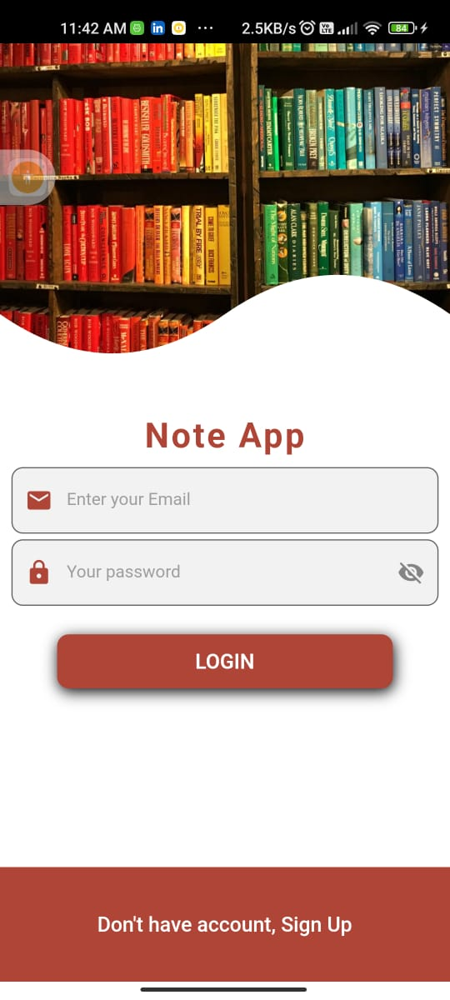
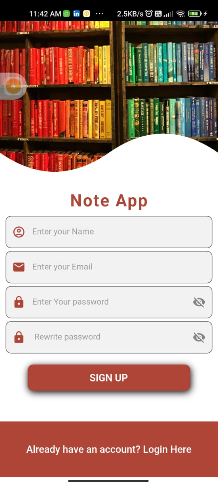
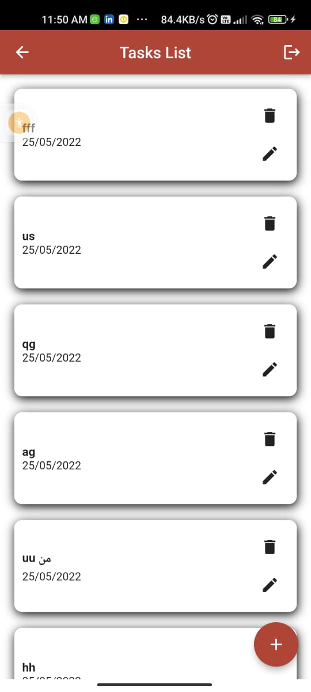
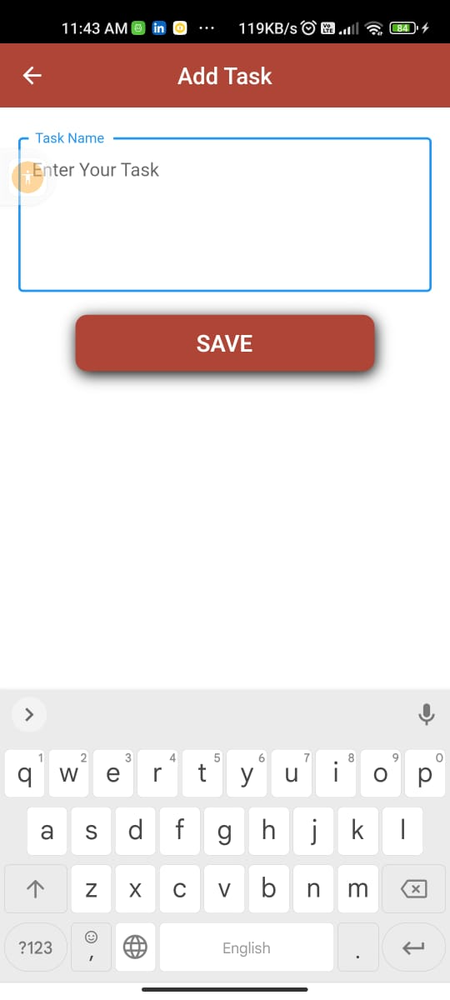
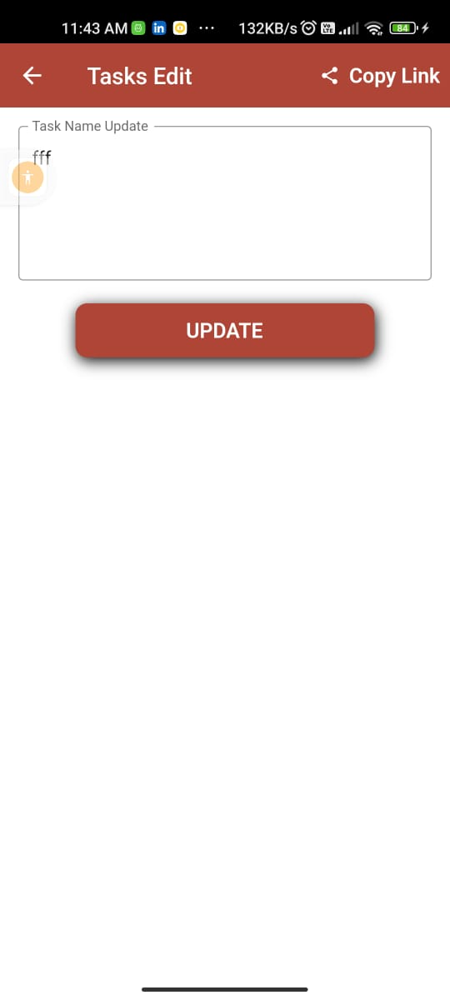

# task_app
A simple small notepad allowing creating and editing text Notes using realtimeFirebase DataBase .

</img>
</img>
</img>
</img>
</img>
</img>

 
https://user-images.githubusercontent.com/26741217/170120593-b9e15011-134d-48b2-b0ae-3d9ae6083ac6.mp4
  
  

✨ App Features :
  

.Native Splash screen.

.Search bar for searching about any product.

.Possibility to save favorite product.

