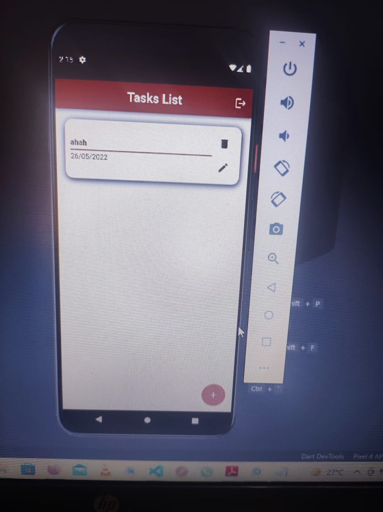
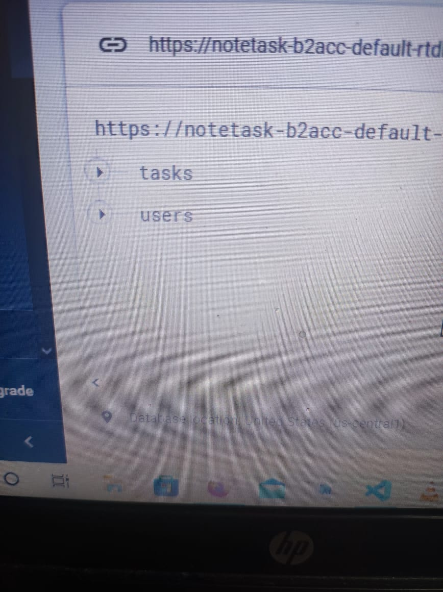

# TaskApp
A simple small notepad allowing creating and editing text Notes using RealTime Firebase Database Plugin for Flutter .

</img>
</img>
</img>
</img>
</img>
</img>
</img>

 
https://user-images.githubusercontent.com/26741217/170120593-b9e15011-134d-48b2-b0ae-3d9ae6083ac6.mp4
  
  

✨ App Features :

.firebase_auth.

.firebase_database.

.firebase_core.

.flutter_launcher_icons.

.fluttertoast.

.ndialog.

.share.

.intl.

